# 3D Pathfinding Algorithm Visualizer

*An interactive 3D visualization tool for pathfinding algorithms with real-time Gouraud shading*

Visualize Dijkstra's and A algorithms in beautiful 3D with customizable lighting and interactive controls*

## Table of Contents
- [Features](#features)
- [Visual Demonstration](#visual-demonstration)
- [System Architecture](#system-architecture)
- [Installation](#installation)
- [Usage Guide](#usage-guide)
- [Visual Features](#visual-features)
- [Algorithms Implemented](#algorithms-implemented)
- [Technical Details](#technical-details)

## Features

### Core Functionality
- *Dual Algorithm Visualization*: Real-time execution of both Dijkstra's and A* algorithms
- *Interactive 3D Grid*: 30×30 fully interactive grid with click-to-edit functionality
- *Four Edit Modes*: Set start point, goal point, obstacles, or clear tiles
- *Real-time Controls*: Pause, resume, stop, and speed adjustment during execution

### Advanced Graphics
- *Gouraud Shading*: Per-vertex lighting with ambient, diffuse, and specular components
- *Dynamic Lighting*: Adjustable light position, intensity, and material properties
- *Multiple Minimap Views*: Rectangular, circular (radar-style), and zoomed views
- *3D Credit Wall*: Floating text rendering with smooth animations

### User Experience
- *ImGui Interface*: Professional control panel with collapsible sections
- *Free-flight Camera*: WASD movement with mouse look and zoom controls
- *Real-time Statistics*: Nodes explored, path length, execution time tracking
- *Intuitive Controls*: Tab toggles between UI mode and free-flight camera

## Visual Demonstration

### Screenshots Gallery

#### Initialization
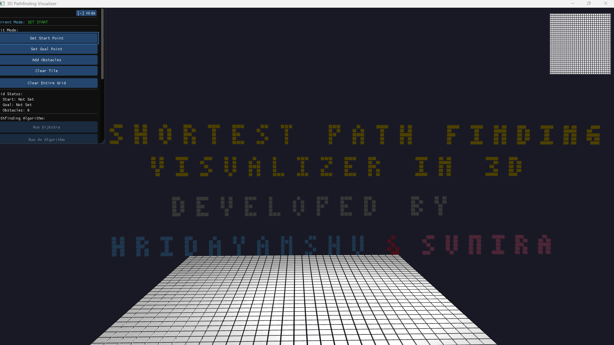  

#### Control Panel Variations
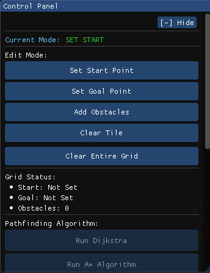  

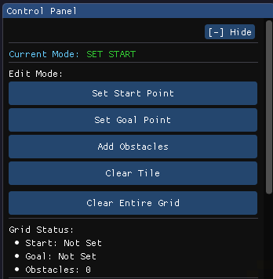  

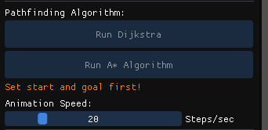  

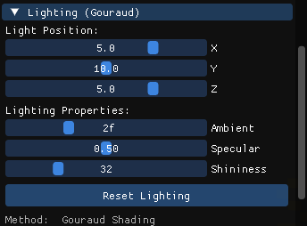  

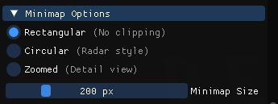  

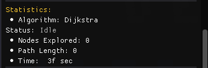  

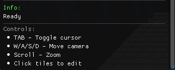  

#### Grid Visualization
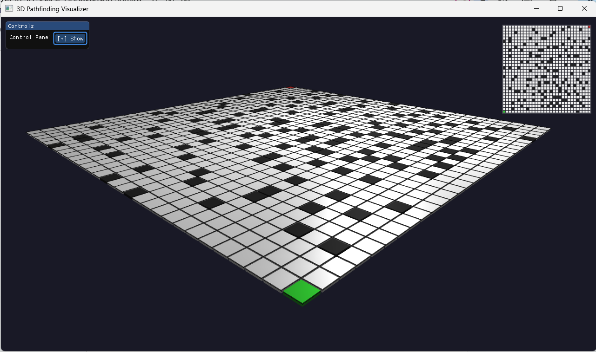  

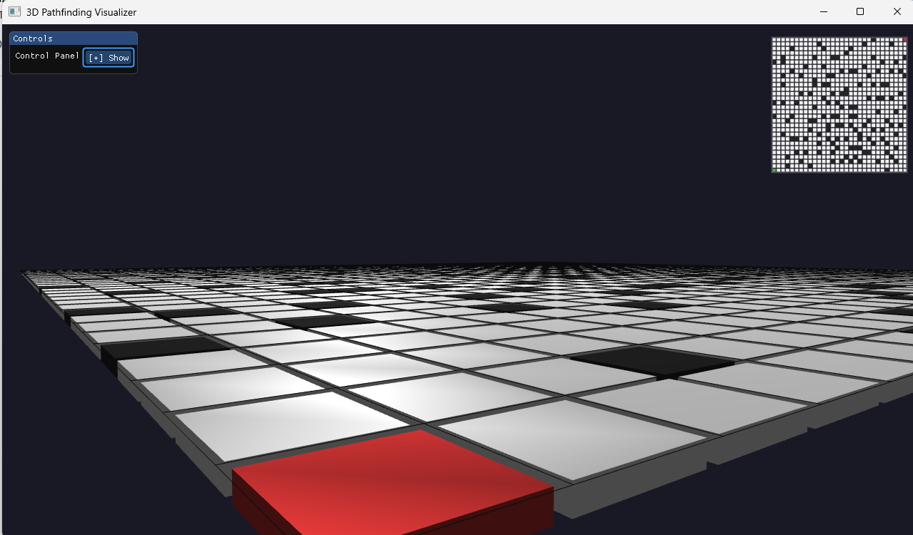  

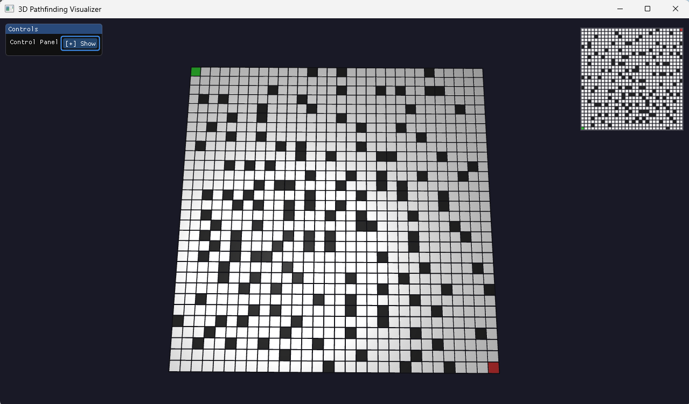  

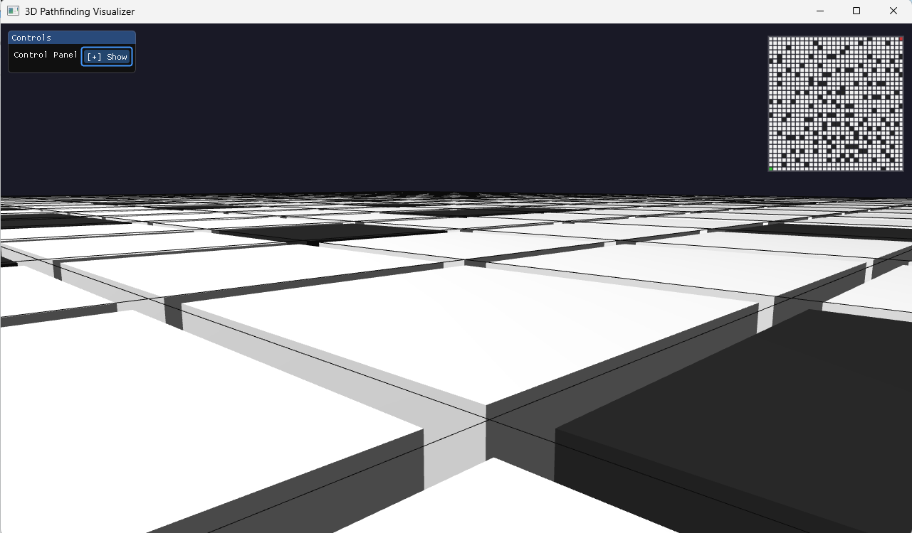  

#### Algorithm Visualizations

*Dijkstra's Algorithm*
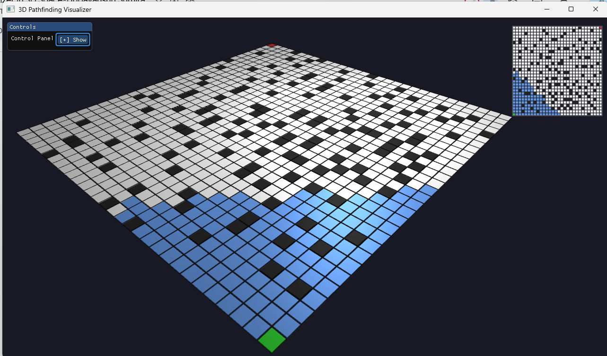  

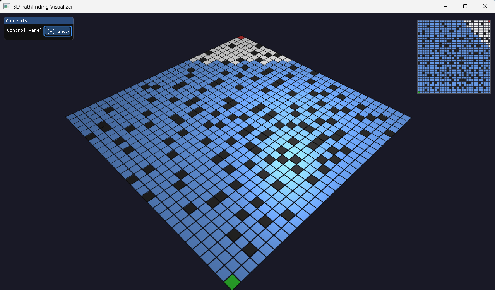  

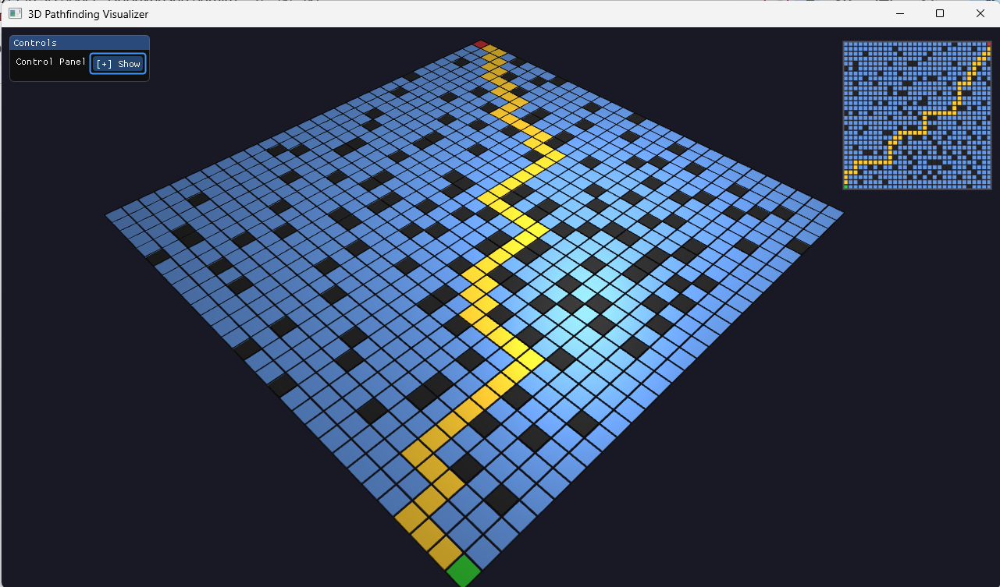  

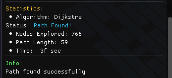  

*A Algorithm**
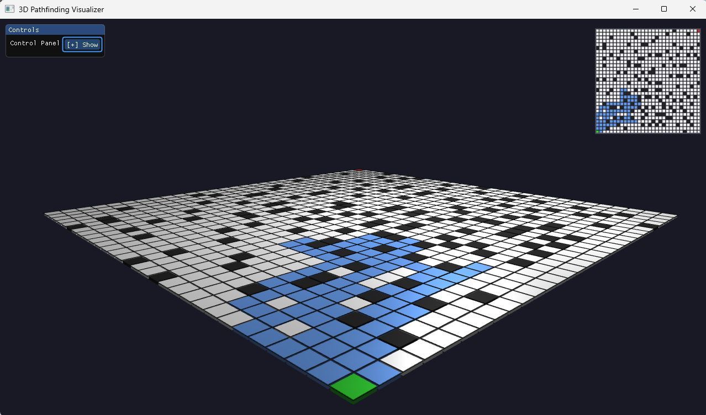  

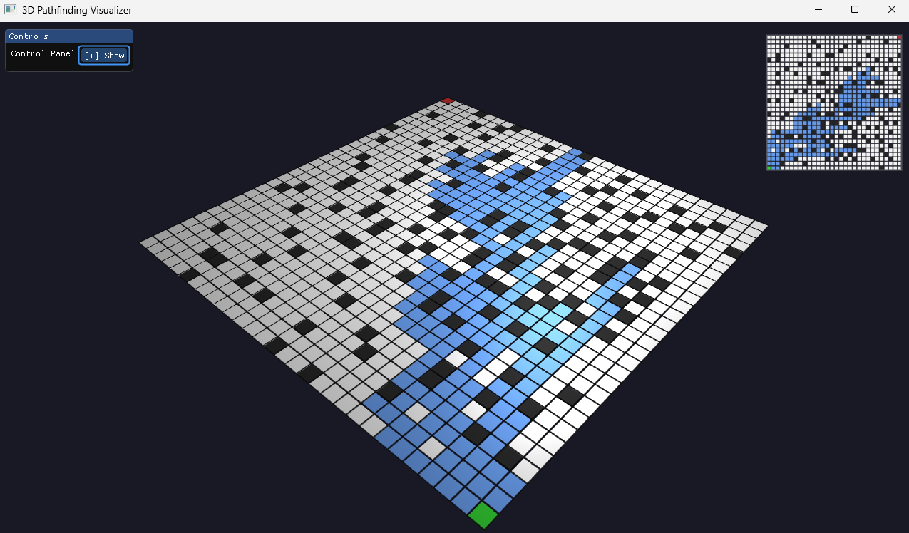  

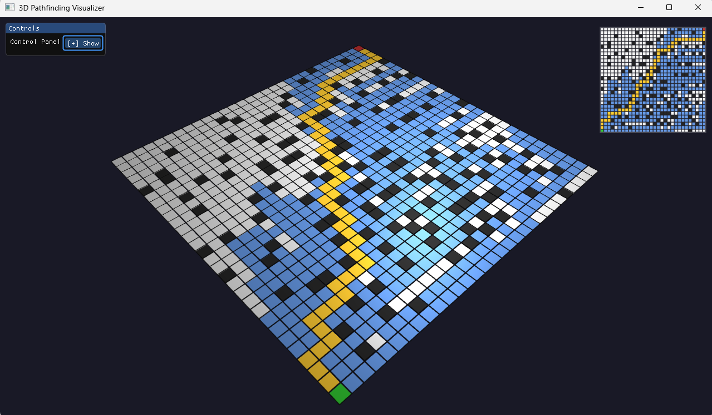  

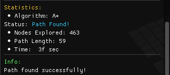  

#### Minimap System
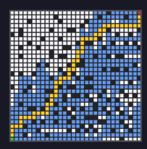  

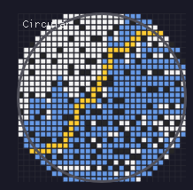  

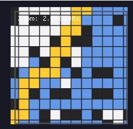  

## System Architecture

mermaid
graph TB
    subgraph "Input Layer"
        A[Mouse/Keyboard Input]
        B[ImGui Interface]
    end
    
    subgraph "Core Engine"
        C[Main Application Loop]
        D[Grid Management System]
        E[Pathfinding Algorithms]
        F[3D Rendering Pipeline]
        G[Camera System]
    end
    
    subgraph "Graphics Pipeline"
        H[Vertex Processing]
        I[Gouraud Shading]
        J[Fragment Processing]
        K[Minimap Rendering]
    end
    
    subgraph "Output"
        L[3D Visualization]
        M[Statistics Display]
        N[User Feedback]
    end
    
    A --> C
    B --> C
    C --> D
    C --> E
    C --> F
    C --> G
    D --> F
    E --> F
    G --> F
    F --> H --> I --> J --> L
    F --> K --> L
    E --> M
    C --> N

*Key Components:*
- *Main Loop*: Coordinates all system components at 60 FPS
- *Grid System*: Manages 30×30 tile state matrix
- *Pathfinding Engine*: Implements Dijkstra and A* with animation system
- *Rendering Pipeline*: OpenGL-based with Gouraud shading
- *Camera System*: Free-flight with Euler angles
- *UI System*: ImGui-based with request-response pattern

## Installation

### Prerequisites
- Windows 10/11 (64-bit)
- Visual Studio 2019/2022
- OpenGL 3.3+ compatible GPU

### Step-by-Step Setup

1. *Clone the Repository*
   
   git clone https://github.com/hridayanshu236/ShortestPathVisualizer3d.git
   

2. *Install Dependencies*
   - Ensure you have the following in your libs/ directory:
     - GLFW 3.4.0
     - GLM 0.9.9+
     - ImGui 1.92.2
     - GLAD (OpenGL 3.3 Core)

3. *Configure Visual Studio*
   - Open PathfindingVisualizer.sln
   - Set build configuration to *Release | x64*
   - Ensure all include directories point correctly

4. *Build and Run*
   - Build solution (Ctrl+Shift+B)
   - Run without debugging (Ctrl+F5)

## Usage Guide

### Getting Started

1. *Launch the Application*
   
   > Starting 3D Pathfinding Visualizer...
   > OpenGL Version: 4.6.0
   > UI initialized successfully!
   

2. *Set Up Your Grid*
   - Use the *Control Panel* on the left to select edit mode
   - Click on the 3D grid to place:
     - Green: Start Point
     - Red: Goal Point
     - Black: Obstacles
   - Use *Clear Tile* mode to remove any placement

3. *Run an Algorithm*
   - Ensure both start and goal are set
   - Choose algorithm:
     - *Run Dijkstra*: Uniform cost expansion
     - *Run A**: Heuristic-guided search
   - Adjust speed with the *Steps/sec* slider (1-100)

### Control Reference

| Action | Key/Mouse | Description |
|--------|-----------|-------------|
| Toggle UI/Camera | TAB | Switch between interface and free-flight mode |
| Camera Movement | WASD | Move in free-flight mode |
| Camera Look | Mouse Move | Adjust view direction |
| Zoom | Mouse Scroll | Change field of view |
| Edit Tile | Left Click | Place/remove based on current mode |
| Clear Grid | UI Button | Reset entire grid to empty state |

### Advanced Features

#### Lighting Controls (Gouraud Shading)
- *Light Position*: Drag X, Y, Z sliders to move light source
- *Ambient Strength*: Overall scene brightness (0.0-1.0)
- *Specular Strength*: Highlight intensity (0.0-1.0)
- *Shininess*: Specular focus (1-128)

#### Minimap Options
- *Rectangular*: Complete grid overview
- *Circular*: Radar-style with clipping
- *Zoomed*: Detailed view with adjustable center and zoom (1-5×)

## Visual Features

### Gouraud Shading Implementation
glsl
// Vertex Shader - Per-vertex lighting calculations
vec3 LightingColor = (ambient + diffuse + specular) * tileColor;

// Fragment Shader - Simple interpolation
FragColor = vec4(LightingColor, 1.0);

*Lighting Components:*
- *Ambient*: Constant background illumination
- *Diffuse*: Lambertian reflection based on surface normal
- *Specular*: Blinn-Phong highlights for shiny surfaces

### Minimap System
Three distinct visualization techniques:

| Type | Technique | Use Case |
|------|-----------|----------|
| Rectangular | Simple scaling | Overall grid status |
| Circular | PushClipRect() with bounds | Radar-style navigation |
| Zoomed | Dynamic viewport calculation | Detailed analysis |

### Ray Casting for Tile Selection
// Screen space → World space ray conversion
glm::vec3 rayDir = GetMouseRay(mouseX, mouseY, screenWidth, screenHeight, view, projection);

// AABB intersection test for each tile
if (RayIntersectsTile(cameraPos, rayDir, x, z, distance)) {
    // Tile selected!
}

## Algorithms Implemented

### Dijkstra's Algorithm
- *Type*: Uniform Cost Search
- *Complexity*: O(V log V + E) with binary heap
- *Guarantee*: Always finds shortest path
- *Visual Pattern*: Circular expansion from start

*Key Implementation:*
// Priority queue ordered by gCost (distance from start)
std::priority_queue<Node*, std::vector<Node*>, NodeComparator> openSet;

### A* Algorithm
- *Type*: Best-First Search with heuristic
- *Heuristic*: Manhattan Distance
- *Admissibility*: Always ≤ actual distance
- *Visual Pattern*: Directed expansion toward goal

*Key Implementation:*
// fCost = gCost + hCost (actual + heuristic)
float Heuristic(int x1, int z1, int x2, int z2) {
    return abs(x1 - x2) + abs(z1 - z2); // Manhattan
}

### Animation System
- *Step-by-step execution* at user-controlled speed
- *Real-time statistics* update during execution
- *Pause/Resume/Stop* controls for learning
- *Visual feedback* for visited nodes and final path

## Technical Details

### Dependencies & Versions
| Library | Version | Purpose |
|---------|---------|---------|
| OpenGL | 3.3+ | Graphics rendering API |
| GLFW | 3.4.0 | Window and input management |
| GLAD | 3.3 Core | OpenGL function loading |
| GLM | 0.9.9+ | Mathematics library |
| ImGui | 1.92.2 | Immediate-mode GUI |
| MSVC | v143 | C++17 compiler |

## Authors

### Developed as a miniproject for COMP 342 - Computer Graphics

| Developer | Role | Contribution |
|-----------|------|--------------|
| [Hridayanshu Raj Acharya](https://github.com/hridayanshu236) | Core Developer | Graphics Pipeline, Shading, Camera System |
| [Sumira Makaju](https://github.com/SumiraMakaju) | Core Developer | Pathfinding Algorithms, UI System, Grid Management |

*Department:* Computer Science and Engineering  
*University:* Kathmandu University, Dhulikhel, Kavre  
